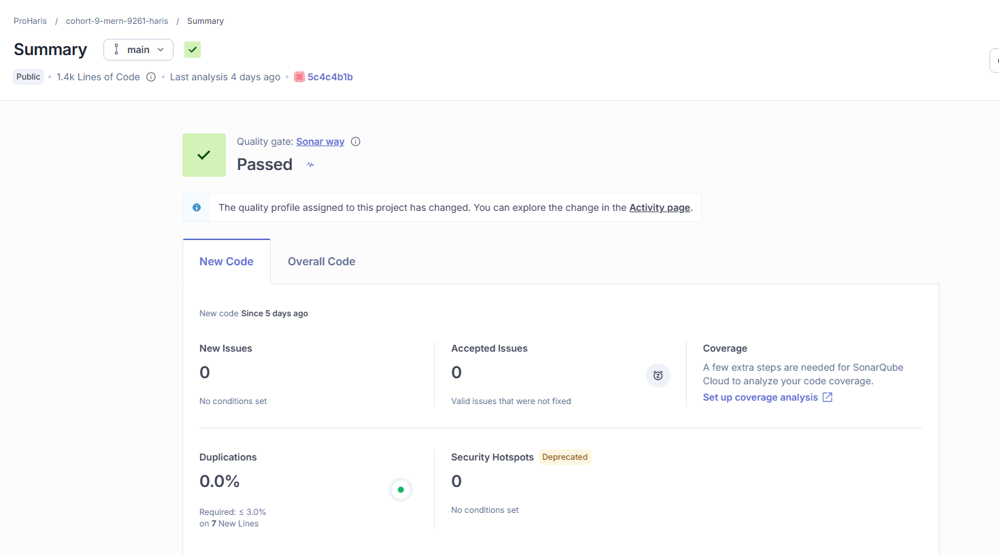
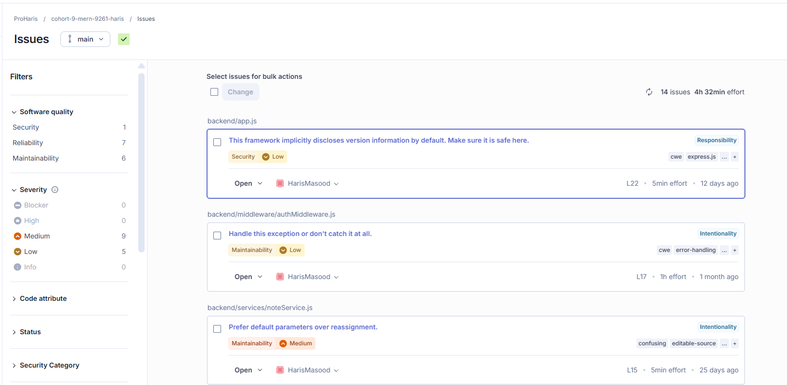

# SonarQube Analysis

This project uses **SonarCloud** (cloud-hosted SonarQube) integrated with GitHub Actions for continuous code quality analysis.

## Setup
- Organization: `harood` (ProHaris)
- Project key: `Harood_cohort-9-mern-9261-haris`
- Analysis runs automatically on every push to `main` via `.github/workflows/build.yml`
- Config: see `sonar-project.properties` at repo root

## Live Results
[View live SonarCloud dashboard](https://sonarcloud.io/project/overview?id=Harood_cohort-9-mern-9261-haris)

## Latest Analysis Snapshot
Quality Gate: **Passed** ✅

